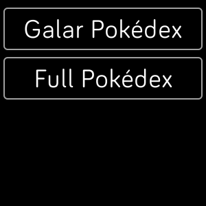
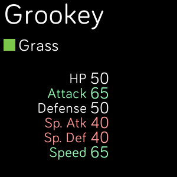

# PokéLAB SW/SH

**[ Download it!](https://gallery.fitbit.com/details/d8e1ca84-1b02-4ac8-8e47-f18c98888895)**

## Documentation

- [English](./doc/en/description.md).
- [Spanish](./doc/es/description.md).

## Screenshots

### Main

### Pokémon list

### Pokémon details

